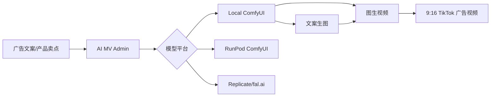

# AI MV

面向 TikTok 广告素材的 AI 生成后台：文案生图、图生视频、多模型平台配置、ComfyUI 本地/云端推理接入。

## 当前已搭建

- Node.js 零依赖管理后台，默认端口 `3000`
- 模型平台配置文件：`data/config/providers.json`
- 支持配置多个平台：本地 ComfyUI、RunPod ComfyUI、Replicate、fal.ai
- ComfyUI 提交接口：`POST /api/jobs`
- ComfyUI 状态检测：`GET /api/providers/:id/status`
- 基础 Web 管理页面：`http://localhost:3000`
- ComfyUI 安装脚本：`scripts/setup-comfyui.sh`

## 推荐架构



## 快速启动后台

```bash
npm start
```

打开：

```text
http://localhost:3000
```

## 部署 ComfyUI

```bash
./scripts/setup-comfyui.sh
cd ComfyUI
source .venv/bin/activate
python main.py --listen 127.0.0.1 --port 8188
```

启动后，在后台点击“检测选中 ComfyUI”。

## 模型目录建议

脚本会让 ComfyUI 额外读取：

```text
models/checkpoints
models/vae
models/loras
models/clip
models/unet
models/diffusion_models
models/text_encoders
```

你可以把 SDXL、Flux、Wan2.2、LTX-Video 等模型文件按 ComfyUI 节点要求放入对应目录。

## 配置多平台模型

编辑后台的“模型平台配置”，或直接改：

```text
data/config/providers.json
```

字段说明：

- `platform`: 当前预留 `comfyui`、`replicate`、`fal`
- `enabled`: 是否启用该平台
- `baseUrl`: API 地址，本地 ComfyUI 默认 `http://127.0.0.1:8188`
- `apiKey`: 云平台密钥，本地可留空
- `models`: 记录文生图、图生视频模型名
- `workflows`: ComfyUI API workflow JSON 路径

## 工作流说明

- `workflows/text-to-image.json` 是 SDXL 风格的基础 API workflow 模板。
- `workflows/image-to-video.json` 是占位模板，需要替换成真实 Wan2.2 I2V 或 LTX-Video 的 ComfyUI API workflow。
- 后台会自动替换这些占位符：`{{PROMPT}}`、`{{NEGATIVE_PROMPT}}`、`{{IMAGE_PATH}}`、`{{SEED}}`、`{{WIDTH}}`、`{{HEIGHT}}`、`{{FRAMES}}`、`{{FPS}}`。

## 下一步建议

1. 安装 ComfyUI Manager。
2. 在 ComfyUI 里导入 Wan2.2 I2V 或 LTX-Video 工作流。
3. 从 ComfyUI 导出 API Format JSON。
4. 覆盖 `workflows/image-to-video.json`。
5. 在后台提交图生视频测试任务。

## HappyHorse / 阿里百炼对接

当前后台已改成极简模式：页面只需要选择模型、输入 API Key、填写提示词。Endpoint、Header、请求体均在后端写死。

### 支持模型

- `HappyHorse 文生视频`：后端固定调用 `happyhorse-1.0-t2v`
- `HappyHorse 图生视频`：后端固定调用 `happyhorse-1.0-i2v`

### 固定接口

北京地域：

```text
POST https://dashscope.aliyuncs.com/api/v1/services/aigc/video-generation/video-synthesis
GET  https://dashscope.aliyuncs.com/api/v1/tasks/{task_id}
```

请求头由后端固定生成：

```text
Content-Type: application/json
X-DashScope-Async: enable
Authorization: Bearer 你在页面输入的 API Key
```

### 页面使用

```bash
npm start
```

打开：

```text
http://localhost:3000
```

操作流程：

1. 选择 `HappyHorse 文生视频` 或 `HappyHorse 图生视频`。
2. 输入阿里百炼 API Key。
3. 输入提示词；图生视频还需要输入公网首帧图片 URL。
4. 设置清晰度、比例、时长、Seed、水印。
5. 点击 `创建任务`。
6. 等待 1-5 分钟后点击 `刷新结果`。

### 后端 API

创建文生视频任务：

```bash
curl -X POST http://127.0.0.1:3000/api/jobs \
  -H 'Content-Type: application/json' \
  -d '{
    "providerId": "aliyun-bailian",
    "workflowType": "textToVideo",
    "input": {
      "apiKey": "sk-你的key",
      "prompt": "一座由硬纸板和瓶盖搭建的微型城市，在夜晚焕发出生机。",
      "resolution": "720P",
      "ratio": "9:16",
      "duration": 5,
      "watermark": false
    }
  }'
```

创建图生视频任务：

```bash
curl -X POST http://127.0.0.1:3000/api/jobs \
  -H 'Content-Type: application/json' \
  -d '{
    "providerId": "aliyun-bailian",
    "workflowType": "imageToVideo",
    "input": {
      "apiKey": "sk-你的key",
      "prompt": "一只猫在草地上奔跑",
      "imageUrl": "https://cdn.translate.alibaba.com/r/wanx-demo-1.png",
      "resolution": "720P",
      "duration": 5,
      "watermark": false
    }
  }'
```

刷新任务：

```bash
curl http://127.0.0.1:3000/api/jobs/你的本地job-id/refresh
```

说明：页面输入的 API Key 只参与本次调用，后端保存 job 时会剔除 `apiKey`，避免落盘。

## OpenAI GPT Image 2 文生图

后台已接入 `gpt-image-2`，用于文案生图。先在 `/admin773441?admin=7c` 保存 OpenAI API Key，然后生成页面只需要选择 `GPT Image 2 文案生图` 并填写提示词。

### 固定接口

```text
POST https://api.openai.com/v1/images/generations
```

后端固定请求：

```json
{
  "model": "gpt-image-2",
  "prompt": "你的提示词",
  "size": "1024x1536",
  "quality": "high",
  "output_format": "png",
  "n": 1
}
```

### 生成结果

OpenAI 返回的图片会保存到：

```text
data/outputs/{jobId}.png
```

页面会自动显示图片预览，并提供 `/outputs/{jobId}.png` 访问链接。

### 示例 Prompt

```text
写实摄影风格，一名30岁左右的亚洲工厂工人在现代化车间内工作，穿着蓝色工服、安全帽和防护手套，正在检查一台精密工业设备，背景有整洁的生产线、金属机械、柔和工业灯光，商业广告质感，竖屏9:16，无文字，无logo
```

## SaaS 后台配置 / SQLite

当前项目已升级为 SaaS 风格：API Key 不再由生成页面输入，而是在独立后台配置，并保存到 SQLite。

### 后台地址

```text
http://localhost:3000/admin773441?admin=7c
```

### 配置流程

1. 打开 `/admin773441?admin=7c`。
2. 选择 `OpenAI GPT Image 2` 或 `阿里 HappyHorse`。
3. 输入对应平台的 API Key。
4. 设置默认参数，比如图片尺寸、图片质量、视频比例、视频时长。
5. 点击 `保存配置`。
6. 回到 `/` 生成页面，用户只需要选择模型并填写提示词。

### 数据库存储

SQLite 数据库会自动创建：

```text
data/ai-mv.sqlite
```

当前保存内容：

- 平台配置
- API Key
- 默认模型参数
- 生成任务记录
- 生成输出路径

说明：当前版本未做登录和密钥加密，适合本地开发和 MVP。正式 SaaS 上线前建议增加管理员登录、API Key 加密、租户隔离和权限控制。

## Next/shadcn Dashboard + SQLite 自建登录

已接入 `dashboard/` 作为新的 React/Next.js 中后台前端，保留模板 Dashboard Layout、Sidebar、Header、主题和 shadcn 组件体系。

### 启动方式

终端 1：启动现有 Node/SQLite API：

```bash
cd /Volumes/Lexar/web/ai-mv
npm run api:start
```

终端 2：启动 Next Dashboard：

```bash
cd /Volumes/Lexar/web/ai-mv
npm run dashboard:dev
```

访问：

```text
http://127.0.0.1:3006/auth/sign-in
```

默认管理员：

```text
邮箱：admin@7c.local
密码：7cadmin123
```

### 权限设计

- `admin`：可访问模型配置、用户管理、全部任务记录。
- `customer`：可访问素材生成、素材库、自己的任务入口。

### 当前菜单

- 数据概览
- AI 素材生成
- 素材库
- 任务记录
- 模型配置（管理员）
- 用户管理（管理员）
- 账户设置

说明：登录系统已从 Clerk 切换为 SQLite 自建 Session。模板里的 Clerk 演示依赖仍保留在未使用的演示页面和依赖包中，后续可做深度清理。
